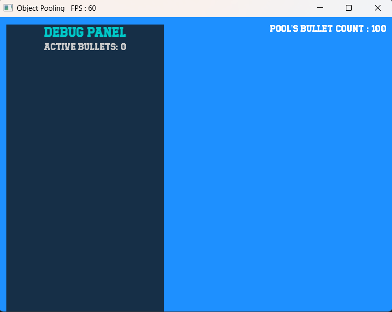

# ObjectPool (C++ Template Class)

A simple and generic **Object Pool** implementation in C++ using templates.  
Built as a learning project to understand memory management and object reuse patterns in C++.

> Made by a student learning C++, open to feedback and improvements!

---

## Quick Preview

| Pool Idle (showing baseline count)         | Pool Active (objects being reused)     |
|--------------------------------------------|----------------------------------------|
| | |

---
*Example: Pool managing 100 objects in a simple SFML demo.*

---

## Why Use This?

- Efficiently reuse objects without constant memory allocation/deallocation.
- Great for games, simulations, or any system where object reuse improves performance.
- Uses `std::vector<std::unique_ptr<Object>>` internally, giving:
  - **Stack behavior** for quick acquire/release (`push_back`, `pop_back`, `back`)
  - **Easy iteration** with range-based for loops.

---

## Features

- Written as a C++ template: `ObjectPool<Object>`
- Stores inactive objects in a `std::vector<std::unique_ptr<Object>>` stack
- `acquire()` gives you a reusable object
- `release(std::move(obj))` returns the object to the pool
- Works with any movable object type (copyable optional). For std::unique_ptr<T>, you must use `std::move()` when transferring ownership.

---

## Example Usage

### 🚫 Without `Args`

```cpp
#include "ObjectPool.hpp"
#include <iostream>
#include <string>

struct MyObject {
    int id;
    MyObject(int id = 0) : id(id) {}
};

int main() {
    ObjectPool<MyObject> pool;
    //ObjectPool<MyObject> pool{100}; // Preallocate 100 objects

    // Acquire an object from the pool
    auto obj = pool.acquire();
    obj->id = 42;
    std::cout << "Using object with id = " << obj->id << "\n";

    // Return the object to the pool
    pool.release(std::move(obj));

    // Re-acquire (reuse) the object
    auto reused = pool.acquire();
    std::cout << "Reused object with id = " << reused->id << "\n";

    // Iterate over all objects in the pool
    for (auto& o : pool.getAllObjects()) {
        std::cout << o->id << "\n";
    }

    return 0;
}
```

### ✅ With `Args`

```cpp
#include "ObjectPool.hpp"
#include <iostream>
#include <sstream>

#define LOG(x) std::cout << x << "\n"

class Enemy {
private:
    float m_health;
    float m_shield;
    std::string m_ability;
    float m_speed;          
    int m_level;           
    std::string m_name;   

public:
    Enemy(float health, float shield, const std::string& ability, float speed = 1.0f, int level = 1, const std::string& name = "Enemy")
        : m_health(health), m_shield(shield), m_ability(ability), m_speed(speed), m_level(level), m_name(name) {}
    ~Enemy() {}

    void attack() {
        std::cout << m_name << " attacks with " << m_ability << " (Level " << m_level << ")\n";
    }

    void reset(float health = 100.0f, float shield = 50.0f, const std::string& ability = "Basic Attack", float speed = 1.0f, int level = 1, const std::string& name = "Enemy") {
        m_health = health;
        m_shield = shield;
        m_ability = ability;
        m_speed = speed;
        m_level = level;
        m_name = name;
        LOG(m_name << " has been reset.");
    }

    std::string toJSON() const {
        std::ostringstream oss;
        oss << "{\n"
            << "\t\"name\":\"" << m_name << "\",\n"
            << "\t\"health\":" << m_health << ",\n"
            << "\t\"shield\":" << m_shield << ",\n"
            << "\t\"ability\":\"" << m_ability << "\",\n"
            << "\t\"speed\":" << m_speed << ",\n"
            << "\t\"level\":" << m_level << "\n"
            << "}";
        return oss.str();
    }
};

int main() {

    ObjectPool<Enemy, float, float, const std::string&> enemyPool(10, 100.f, 50.f, "Fire Punch");

    auto enemy = enemyPool.acquire();

    enemy->attack();

    LOG(enemy->toJSON());

    enemyPool.release(std::move(enemy));

    return 0;
}
```
---

## Object Pool Internals

The pool is implemented as:

```cpp
std::vector<std::unique_ptr<Object>> pool;
```

Objects are managed in a **stack-like** manner:

* `acquire()` retrieves the object at `back()` and removes it from the pool (`pop_back()`).
* `release(std::move(obj))` returns an object to the pool using `push_back(std::move(obj))`.

When the pool is empty, `acquire()` will **construct a new object**. If the pool was initialized with constructor arguments, these are **perfectly forwarded** using `std::forward`; otherwise, objects are **default-constructed**.

---

## Build Instructions

A **Makefile** is included to simplify compiling the project(demo).

- [x] Works on **Unix/Linux/macOS**
- [x] Compatible with **Windows (NT)** using environments like:
  - [MinGW](https://www.mingw-w64.org/)
  - [WSL (Windows Subsystem for Linux)](https://learn.microsoft.com/en-us/windows/wsl/)
  - [Git Bash](https://gitforwindows.org/)

#### To build:

```bash
make run
```

This will compile the project using `g++` with C++17.  
You can customize the `Makefile` as needed for your system or compiler.

---

## Dependencies

The core object pool (`include/ObjectPool.hpp`) is **header-only** and has **no external dependencies**.

The demo (`demo/` folder) requires:  
- [SFML](https://www.sfml-dev.org/) (installed via MSYS2 recommended)

On MSYS2 (64-bit MinGW):

```bash
pacman -S mingw-w64-x86_64-sfml
```

---

## To-Do / Learning Goals

- [x] Add support for custom object initialization
- [ ] Add thread-safety (maybe with mutex?)
- [ ] Benchmark vs. dynamic allocation
- [ ] Write unit tests

---

## Credits

This is a self-learning project. Thanks to tutorials, forums, and anyone sharing C++ knowledge online.

---

## 📜 License

This project is licensed under the [MIT License](LICENSE).  
If you learn something from this, that's awesome!